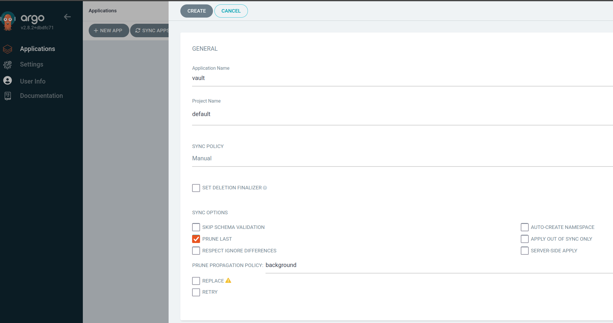

# **awskms-vault-auto-unseal**
Terraform provisioning AWS kms cmk, IAM role, user, policy to facilitate Hashicorp Vault auto unsealing


- [about Demo](#about-demo)
- [Tools](#tools)
- [Workflow of the Design](#workflow-of-the-design)
- [Pre-requisites](#pre-requisites)
- [Security Hardening](#security-hardening)
- [Installation](#installation)
  * [Terraform Cloud](#terraform-cloud)
  * [K8s Cert-manager](#k8s-cert-manager)
  * [(Optional) Install Istio and Kiali](#-optional--install-istio-and-kiali)
  * [ArgoCD Helm Deployment](#argocd-helm-deployment)
  * [Hashicorp Vault Deployment using ArgoCD](#hashicorp-vault-deployment-using-argocd)
  * [Vault-helm deployment](#vault-helm-deployment)
- [Uninstall](#uninstall)
  * [Delete vault from argocd](#delete-vault-from-argocd)
  * [Terraform destroy KMS](#terraform-destroy-kms)
- [Best Practice of Vault](#best-practice-of-vault)
  * [Revoke root token](#revoke-root-token)
  * [Re-key](#re-key)
- [External References](#external-references)
- [Troubleshooting](#troubleshooting)
  * [microk8s.enable storage and metallb](#microk8senable-storage-and-metallb)
  * [Proxy error](#proxy-error)
  * [Unable to migrate argocd back to helm installation](#unable-to-migrate-argocd-back-to-helm-installation)
  * [Disable istio](#disable-istio)
  * [Elliptic-curve cryptography certificate](#elliptic-curve-cryptography-certificate)
  * [Cert-manager apiVersion error](#cert-manager-apiversion-error)
  * [Github cannot sync with argocd](#github-cannot-sync-with-argocd)


## about Demo
---
This github repo is a showcase of automation of popular tools to automate the provisioning of AWS KMS which allows vault auto unseal, and then install Hashicorp Vault HA cluster with self-signed certificate in a kubernetes environment using ArgoCD. It achieves the DevSecOps manner to store sensitive keys in a private environment.

## Tools
---
- Terraform Cloud
- AWS
- Kubernetes + Helm
- k8s cert-manager
- Hashicorp Vault helm chart
- ArgoCD
- Istio, Kiali (optional)


## Workflow of the Design
---


1. Provisioning and deploy key management service customer manager key (KMS-CMK) to AWS Cloud
2. Provisioning the user and role based on the IAM policy that can read the KMS-CMK. Retrieving the AWS access key id and secret access key
3. In local environment, deploy cert-manager helm chart
4. deploy argocd helm chart
5. (optional) enable istio injection at --namespace=vault
6. Generate a TLS certificate for --namespace=vault, store the TLS certificate as 3 key-values as a kubernetes secret
7. Store the AWS access key id and secret access key which was newly provisioned to a kubernetes secret
8. VolumeMounts the secret which stores TLS certificate
9. Mount the AWS access key id and secret access key as an environmental variables in the vault pod
10. Deploy Hashicorp Vault helm chart with custom values.yaml with ArgoCD
11. Initialize the vault, it then performs auto unsealing with AWS KMS
12. Validate the vault high-availability cluster RAFT has been auto-joined. Leader is usually vault-0, and peers are vault-1 and vault-2


## Pre-requisites
---
- AWS Cloud
- Terraform Cloud
- Kubernetes + Helm
- (optional) Istio, istioctl, kiali


## Security Hardening
---
1. IAM policy is restricted to kms:Encrypt, kms:Decrypt, kms:DescribeKey permissions towards the KMS CMK's resource name (arn)

2. Redundancy improvement for HA Raft mode had been enabled and 3 pods are created to represent 3 Hashicorp Vault nodes. They joined together to form a HA cluster.
3. When a secret engine is created in one of the vault-0, vault-1, vault-2, it will automatically replicate into other 2 pods


4. TLS is enabled
5. Resources limitation


6. Set volume to directory to /opt/vault instead of the default /vault. This is for better management of aggregating all 3rd-party software to /opt directory
7. (official chart default values) Readiness probe is enabled but liveness probe is disabled by default
8. (official chart default values of container-level security) statefulSet is run as non-root user, not allow privilege escalation
 
 
9. (official chart default values of vault-injector) all capabilities are dropped


## Installation
---
### Terraform Cloud

Terraform scripts are under `awskms` folder

Links the github version control folder to Terraform Cloud, choose the "Terraform Working Directory" and "VCS Branch" to match your github branch. 


Firstly store your AWS access key and AWS secret access key to Terraform Cloud > Workspaces > Variables


Provisioning it and the output shows the KMS key resource name (ARN), copy it down. Must be the full ARN name, not the key alias. 

3 resources are provisioned:
vault_auto_unseal_user
vault_auto_unseal_role  (attached with vault_auto_unseal_policy)
vault_auto_unseal_key

However the newly created AWS_SECRET_ACCESS_KEY is hidden


Go to the workspaces > States, copy down AWS_ACCESS_KEY_ID and AWS_SECRET_ACCESS_KEY of the newly created 'vault_auto_unseal_user'.

> `warning`: tfstate file contains highly confidential data, do not expose it publicly. 


### K8s Cert-manager

Install cert-manager to the kubernetes environment, it simplfies the steps to create a certificate authority, private key, public key 3 files, and then merge them into 1 kubernetes secret. This secret will be further mounted as a directory into the vault pod after the deployment, 3 cert files will appear individually in that mounted directory.

```
kubectl create ns cert-manager

kubectl label ns cert-manager istio-injection=enabled

helm repo add jetstack https://charts.jetstack.io

helm repo update

helm install cert-manager jetstack/cert-manager --namespace cert-manager --create-namespace --set installCRDs=true

```


verify if cert-manager is fine

```
kubectl -n cert-manager get all
```


However for the future ongoing maintenance, helm upgrade doesn't automatically update to the latest CRDs. Below sample command is to manually download and update the CRDs associated with cert-manager
```
kubectl apply -f https://github.com/cert-manager/cert-manager/releases/download/v1.12.0/cert-manager.crds.yaml
```


Run the bash script in directory `initial_setup/k8s_vault_cert_using_certmanager.sh`, it achieve per below
- create directories /opt/vault/data and /opt/vault/audit, add the ubuntu user to have permission to read/write/execute the directory. You may change the username "ubuntu" to your system logon.
- define environmental variables about the --namespace=vault
- Create a self-signed issuer
- Create RSA certificate from the self-signed issuer, a new secret "vault-ha-tls".

```

#!/bin/bash

mkdir -p /opt/vault/data
mkdir -p /opt/vault/audit
chown -R ubuntu:ubuntu /opt/vault


export VAULT_K8S_NAMESPACE="vault" \
export VAULT_HELM_RELEASE_NAME="vault" \
export VAULT_SERVICE_NAME="vault-internal" \
export K8S_CLUSTER_NAME="cluster.local" \

kubectl create ns ${VAULT_K8S_NAMESPACE}
kubectl label ns ${VAULT_K8S_NAMESPACE} istio-injection=enabled

## create a selfsigned-issuer at --namespace="vault"
kubectl apply -f https://gist.githubusercontent.com/t83714/51440e2ed212991655959f45d8d037cc/raw/7b16949f95e2dd61e522e247749d77bc697fd63c/selfsigned-issuer.yaml -n ${VAULT_K8S_NAMESPACE}


## key size: 2048
## PKI needs to renew once per year (8760 hrs = 365 days)
## set to autorotate 15 minutes before expiry date

kubectl apply -f - <<EOF
apiVersion: cert-manager.io/v1
kind: Certificate
metadata:
  name: vault-ha-tls
  namespace: ${VAULT_K8S_NAMESPACE}
spec:
  secretName: vault-ha-tls
  subject:
    organizations:
      - system:nodes
  commonName: system:node:*.${VAULT_K8S_NAMESPACE}.svc.${K8S_CLUSTER_NAME}
  duration: 8760h      # 365d
  renewBefore: 360h    # 15d
  privateKey:
    algorithm: RSA
    encoding: PKCS1
    size: 2048
    rotationPolicy: Always
  usages:
    - digital signature
    - key encipherment
    - server auth
    - client auth
  dnsNames:
    - "*.${VAULT_SERVICE_NAME}"
    - "*.${VAULT_SERVICE_NAME}.${VAULT_K8S_NAMESPACE}.svc.${K8S_CLUSTER_NAME}"
    - "*.${VAULT_K8S_NAMESPACE}"
  issuerRef:
    name: selfsigned-issuer
    kind: ClusterIssuer
EOF


kubectl -n ${VAULT_K8S_NAMESPACE} get secret

```


Expected result is that a new secret called `vault-ha-tls` is created under --namespace=vault and there are 3 encoded data.

- `ca.crt` -- certificate authority is used to verify the authenticity and integrity of other certificates in the chain.
- `tls.crt` -- The TLS certificate is signed by CA. It contains the public key of the entity (e.g., a server) to which it is issued.
- `tls.key` -- The private key associated with the TLS certificate. The private key is kept secret and is used for decrypting incoming TLS connections. It is used in combination with the TLS certificate to establish secure connections.


Create a new secret called `kms-creds`. Both   AWS_ACCESS_KEY_ID and
  AWS_SECRET_ACCESS_KEY must be base64-encoded
can use this sample command to convert a string to base64
`echo "1234" | base64 -d`


### (Optional) Install Istio and Kiali

Install Istio and Kiali
```
curl -L https://istio.io/downloadIstio | sh -

cd istio-1.18.2/tools/samples/addons

k apply -f .

// change ClusterIP to NodePort
k -n istio-system edit svc kiali


// see the exposed NodePort address
k -n istio-system get svc kiali 
```


Alternatively Kiali can be installed with helm chart
```

helm repo add kiali https://kiali.org/helm-charts

helm repo update


helm install \
    --namespace kiali-operator \
    --create-namespace \
    kiali-operator \
    kiali/kiali-operator


helm install \
    --namespace istio-system \
    kiali-server \
    kiali/kiali-server


kubectl port-forward svc/kiali 20001:20001 -n kiali
```

If kiali server is installed within --namespace istio-system, can create a temporary login token which is required to log in Kiali dashboard


```
kubectl -n istio-system create token kiali
```


```
istioctl dashboard kiali&
```


Open http://localhost:20001/kiali or 
open localhost:\<NodePort\> to test if Kiali can be opened, log in with the newly created token. 
> `Note: this token isn't permanent. You will have to generate a new kiali token after system reboot`


Kiali can view service communications at the namespaces which are istio-injection set to enabled


### ArgoCD Helm Deployment

> `Warning`: Once vault is deployed using argocd, the maintenance has to go through argocd because it's disappeared from helm app list. To migrate it back to helm, see `Troubleshooting` section -> `Unable to migrate argocd back to helm installation`

Create a new namespace "argocd", deploy argocd helm chart into this namespace
```
kubectl create namespace argocd

helm repo add argo https://argoproj.github.io/argo-helm

helm repo update

helm -n argocd install argocd argo/argo-cd
```

Install argocd cli
```
curl -sSL -o argocd-linux-amd64 https://github.com/argoproj/argo-cd/releases/latest/download/argocd-linux-amd64
sudo install -m 555 argocd-linux-amd64 /usr/local/bin/argocd
rm argocd-linux-amd64
```


Get the initial admin password with this command

```
kubectl -n argocd get secret argocd-initial-admin-secret -ojson | jq -r '.data.password' | base64 -d


Iltfc4qjP6eGzJdn
```

Port forward the argocd service to be able to open from a browser
```
kubectl port-forward service/argocd-server -n argocd 8080:443&
```


ArgoCD has its own cli called "argocd", you can log in argocd with cli and update default password
```
argocd login localhost:8080

argocd account update-password

argocd relogin
```


### Hashicorp Vault Deployment using ArgoCD

Firstly create a generic secret "kms-creds" that contains the AWS access key id and AWS secret access key, make sure you convert them to base64 prior to put in the declarative yaml file

```
kubectl apply -f -<<EOF
apiVersion: v1
kind: Secret
metadata:
  creationTimestamp: null
  name: kms-creds
  namespace: vault
data:
  AWS_ACCESS_KEY_ID: replaceme_base64
  AWS_SECRET_ACCESS_KEY: replaceme_base64
EOF
```


Find a file `argocd/argo_depl.txt`
In ArgoCD, create new app, click on "edit yaml"
Copy and paste the content of the `argo_depl.txt` into it. Save the setting.


It sets "sync options" > prune propagation policy to "background" which is easier to delete the app later


After creating the app, click on "Sync" button to start synchronization, eventually it says "Healthy" "sync OK" but still yellow alert "OutOfSync". Can leave the yellow alert as it is. 


`kubectl -n vault get all`      to validate that vault-0,1,2 are deployed along with istio envoy as a sidecar container correctly


Log in vault pod, can see the secret `vault-ha-tls` which contains 3 keys are mounted as a folder, 3 keys are separated as 3 files


```
k -n vault exec -ti vault-0 -- sh

ls -la /vault/userconfig/vault-ha-tls
```


Despite the 3 pods of vault-0, vault-1, vault-2 are running fine, it still shows the error logs saying RAFT cluster hadn't been joined and vault hadn't been unsealed.


```
kubectl -n vault logs vault-0 | head
```


`kms-creds` that contains AWS_ACCESS_KEY_ID and AWS_SECRET_ACCESS_KEY of the newly created 'vault_auto_unseal_user' is exported as environmental variables within the vault pods. Now initialize the vault, it will establish the connectivity with AWS cloud and reaches AWS KMS for auto unsealing. Vault root token and 5 recovery keys are auto-generated.

```
kubectl -n vault exec -ti vault-0 -- sh

vault operator init
```


It shortens the lengthy process to manually type in 3 unseal keys to unseal the vault. 
Type in `vault status` and validate that initilialized=true and sealed=false.
Multiple Hashicorp Vaults that are deployed in separate environments can share with the same AWS KMS for auto-unsealing. 


Continue to log in vault with root token
```
vault login <your root token>
```


`vault operator raft list-peers`    to confirm that 3 vault pods had been automatically joined and formed in HA cluster


Port forward tcp:8200 to host port 8200 in the background (&)
```
kubectl -n vault port-forward svc/vault 8200&
```

Open browser https://localhost:8200 to see the GUI


Go back to Kiali, can see the traffic graph and the traffic between namespaces. By default istio envoy traffic is encrypted with mTLS PERMISSIVE MODE(mutual TLS encryption-in-transit allows plaintext + encrypted)


### Vault-helm deployment

This is the traditional way to deploy Hashicorp Vault using Helm Chart and with custom values.yaml

go to `hashivault` and find the `overrides_values.yaml`

```
helm repo add hashicorp https://helm.releases.hashicorp.com

helm repo update

helm -n vault install vault hashicorp/vault -f overrides_values.yaml


## --reuse-values when upgrading, reuse the last release's values and merge in any overrides from the command line via --set and -f. If '--reset-values' is specified, this is ignored

helm upgrade vault hashicorp/vault --namespace vault --reuse-values -f overrides_values.yaml

helm -n vault uninstall vault
```


## Uninstall
---

### Delete vault from argocd

Choose delete background, type 'vault' to confirm deletion


however it won't delete successfully, need to perform deletion one more time by choosing "non-cascading", type 'vault' to confirm deletion


Vault app has finally been deleted from argocd


in linux terminal, kubectl -n vault get all      to confirm that all resources are removed


If get stucked, try manually delete all resources
```
kubectl -n vault delete deploy --all
kubectl -n vault delete svc --all
kubectl -n vault delete sts --all

kubectl -n vault delete sa vault

kubectl -n vault delete sa vault-agent-injector

kubectl -n vault delete cm vault-config

kubectl -n vault delete clusterrole vault-agent-injector-clusterrole

kubectl -n vault delete clusterrolebinding vault-agent-injector-binding

kubectl -n vault delete clusterrolebinding vault-server-binding

kubectl -n vault delete role vault-discovery-role

kubectl -n vault delete rolebinding vault-discovery-rolebinding

kubectl -n vault delete MutatingWebhookConfiguration vault-agent-injector-cfg

kubectl -n vault get all


```


Can force deletion of resources with kubect delete s <Pod_Name> -n <namespace_name> --grace-period=0 --force

e.g.
```
kubectl delete statefulset.apps/vault -n vault --grace-period=0 --force
```


### Terraform destroy KMS

In Terraform Cloud web GUI, can destroy the kms key under workspace > destruction and deletion

Choose "Delete Workspace"


## Best Practice of Vault

### Revoke root token

Once you create your own userpass, it's highly recommended to revoke the root token to reduce security risk because it isn't meant for daily usage.
```
vault token revoke <your root token>
```


### Re-key

If your employee that is a recovery key-holders just left your company or you accidentally lost 2 unseal keys out of 5, you can generate a new set of 5 unseal keys by the `re-key process` with the remaining 3 keys.

This command kicks in the rekey initilization
```
vault operator rekey -init -target=recovery
```

It generates a nonce, copy it down


Enter `vault operator rekey -target=recovery`  3 times, type in the correct recovery key 3 times, eventually it generates 5 new unseal keys

```
vault operator rekey -target=recovery
```


## External References
---
- manual way to generate CSR cert and TLS enabled in kubernetes
https://developer.hashicorp.com/vault/tutorials/kubernetes/kubernetes-minikube-tls

- Hashicorp Vault helm chart official github repo
[hashicorp/vault-helm: Helm chart to install Vault and other associated components. (github.com)](https://github.com/hashicorp/vault-helm/tree/main)

- Terraform AWS provider documentation
[aws_iam_role_policy | Resources | hashicorp/aws | Terraform | Terraform Registry](https://registry.terraform.io/providers/hashicorp/aws/latest/docs/resources/iam_role_policy)

- Official documentation of k8s cert-manager
[Frequently Asked Questions (FAQ) - cert-manager Documentation](https://cert-manager.io/docs/faq/)

- Official site of Istio and Kiali
[Istio / Kiali](https://istio.io/latest/docs/ops/integrations/kiali/)

- Official site of ArgoCD
[Argo CD - Declarative GitOps CD for Kubernetes (argo-cd.readthedocs.io)](https://argo-cd.readthedocs.io/en/stable/)


## Troubleshooting
---

### microk8s.enable storage and metallb

When creating the kubernetes version of Hashicorp Vault in Microk8s for the first time, the PVC is showing at the "pending" status and 
microk8s needs to enable storage add-on before can use pvc

also need to microk8s.enable metallb   to avoid service(LoadBalancer) pending

```
microk8s.enable storage
microk8s.enable metallb
```

If still don't work, check if /opt/vault directory exists because vault's PersistentVolume won't be created if /opt/vault directory doesn't exist.
create /opt/vault folder
assign directory permission to ubuntu

```
sudo mkdir -p /opt/vault/data
sudo mkdir -p /opt/vault/audit
sudo chown -R ubuntu:ubuntu /opt/vault
```


### Proxy error
---

Several error messages show argocd proxy error
```


{"@level":"info","@message":"proxy environment","@timestamp":"2023-08-29T06:19:08.083296Z","http_proxy":"","https_proxy":"","no_proxy":""}

{"@level":"info","@message":"Initializing version history cache for core","@module":"core","@timestamp":"2023-08-29T06:19:08.728845Z"}

Error parsing listener configuration.

Error initializing listener of type tcp: error loading TLS cert: open /vault/userconfig/vault-ha-tls/tls.crt: no such file or directory
```


```
Unable to create application: application spec for vault is invalid: InvalidSpecError: Unable to generate manifests in dependency_helmchart: rpc error: code = Unknown desc = `helm repo add https:--helm.releases.hashicorp.com https://helm.releases.hashicorp.com` failed exit status 1: Error: looks like "https://helm.releases.hashicorp.com" is not a valid chart repository or cannot be reached: Get "https://helm.releases.hashicorp.com/index.yaml": proxyconnect tcp: dial tcp: lookup my-proxy on 10.152.183.10:53: no such host
```


Refer to this documentation for ingress configuration in argocd
[Ingress Configuration - Argo CD - Declarative GitOps CD for Kubernetes (argo-cd.readthedocs.io)](https://argo-cd.readthedocs.io/en/stable/operator-manual/ingress/)


If it still gives error and unable to fix the ingress, follow `Installation > Vault-helm deployment` section to deploy vault using Helm.


### Unable to migrate argocd back to helm installation


Error message shows missing keys on PodDisruptionBudget -n vault
```
mkh -n vault install vault . -f overrides.yaml
Error: INSTALLATION FAILED: rendered manifests contain a resource that already exists. Unable to continue with install: PodDisruptionBudget "vault" in namespace "vault" exists and cannot be imported into the current release: invalid ownership metadata; annotation validation error: missing key "meta.helm.sh/release-name": must be set to "vault"; annotation validation error: missing key "meta.helm.sh/release-namespace": must be set to "vault"

```

PodDisruptionBudgets are only effective if your application is designed to handle pod disruptions gracefully, such as using ReplicaSets or Deployments with proper readiness probes and graceful shutdown mechanisms.
```
kubectl get poddisruptionbudget -n vault -oyaml
```


The way to resolve this is to add keys to poddisruptionbudget under --namespace=vault

```
kubectl edit poddisruptionbudget -n vault
```


Under .meta.annotations, add

```
meta.helm.sh/release-name: vault
meta.helm.sh/release-namespace: vault
```


Under .meta.annotations.kubectl.kubernetes.io/last-applied-configurations: |,   find the .meta.annotations inside the curly bracket, again add `"meta.helm.sh/release-name": "vault", "meta.helm.sh/release-namespace": "vault"`. Make sure to close the curly bracket correctly.


### Disable istio

remove istio from a --namespace=vault, can use this command to unlabel istio 

```
kubectl label namespace vault istio-injection-
```


### Elliptic-curve cryptography certificate

In k8s cert-manager, it's possible to use ECC (elliptic-curve cryptography) rather than the default RSA key. ECDSA has a smaller key size than RSA and still provides the same level of security.

e.g
```
apiVersion: cert-manager.io/v1
kind: Certificate
metadata:
  name: ecdsa
spec:
  secretName: ecdsa-cert
  isCA: false
  privateKey:
    algorithm: ECDSA
    size: 256
  dnsNames:
    - ecdsa.example.com
  ipAddresses:
    - 192.168.1.9
  issuerRef:
    [...]
```


### Cert-manager apiVersion error

If you receive the message like:  

```
error: resource mapping not found for name: "kube-test.svc" namespace: "" from "/dev/fd/63": no matches for kind "Certificate" in version "cert-manager.io/v1alpha2"
```

apiVersion: "cert-manager.io/v1alpha2" is incorrect.
Refer to the official document [cert-manager - cert-manager Documentation](https://cert-manager.io/docs/) for the apiVersion in the YAML file because it can constantly update to beta or other stable versions. 

As for August 2023, correct apiVersion: cert-manager.io/v1


### Github cannot sync with argocd

Since ArgoCD doesn't accept the traditional RSA ssh private key, create SSH key using Edward Curve ed25519 format. Set it to no passphrase.

```
ssh-keygen -t ed25519 -C "argocd" -f argocd
```

`cat ~/.ssh/argocd`     to view the public key, Edward Curve ed25519 key length is a lot shorter than the RSA public key


Copy and paste the private key of ed25519 to Github repo > Deploy keys


cat ~/.ssh/argocd
Copy it into the ssh private key data, and again, Edward Curve private key is also a lot shorter than of RSA.


Argocd shows the green successful of connection status to reach Github


